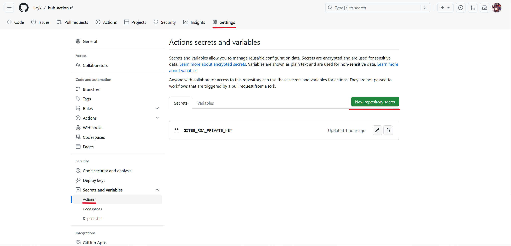
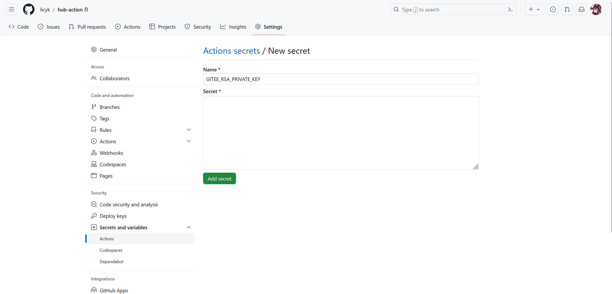
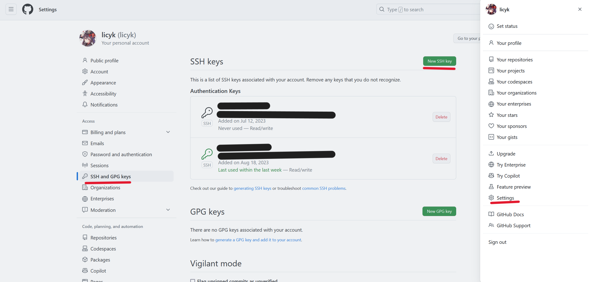
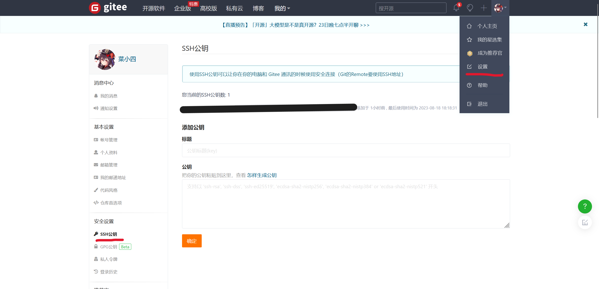
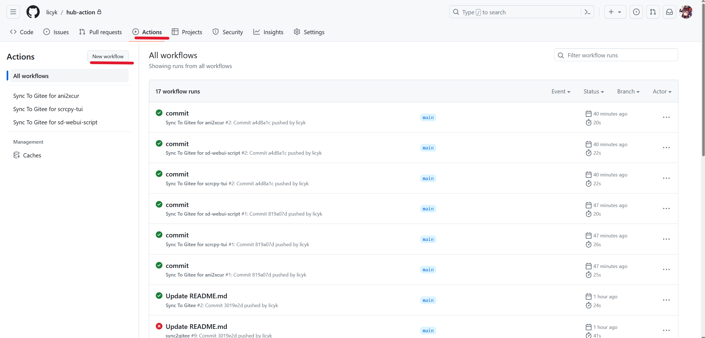
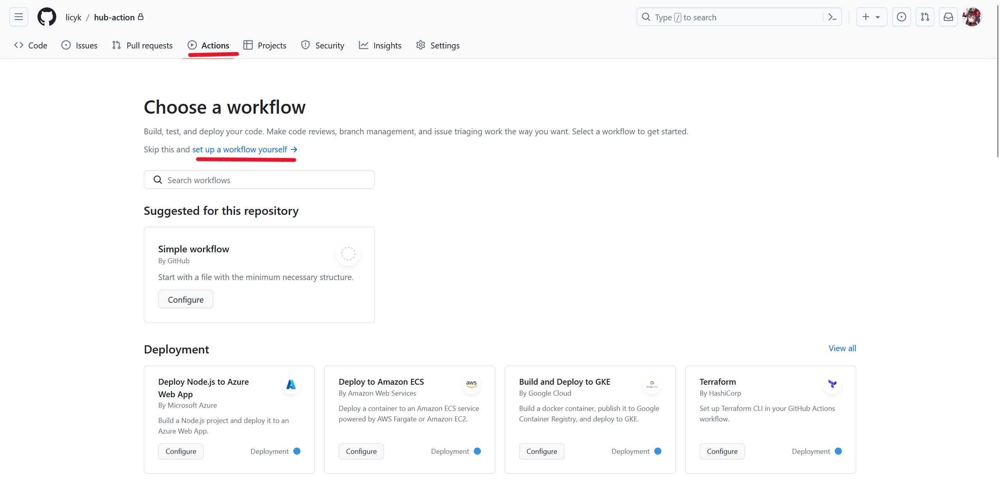
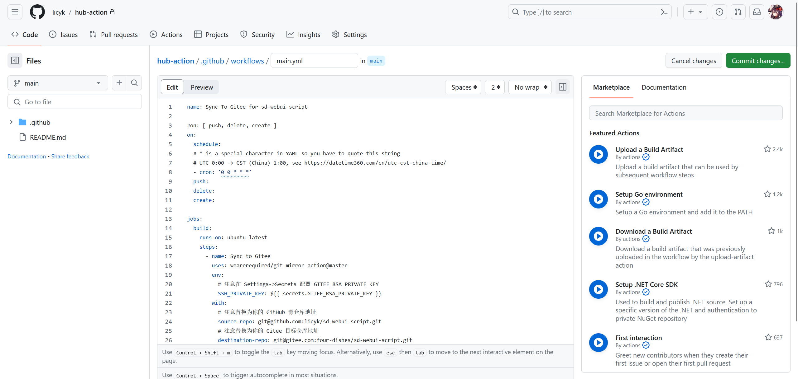
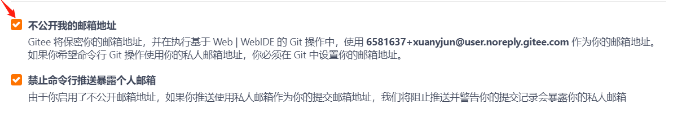
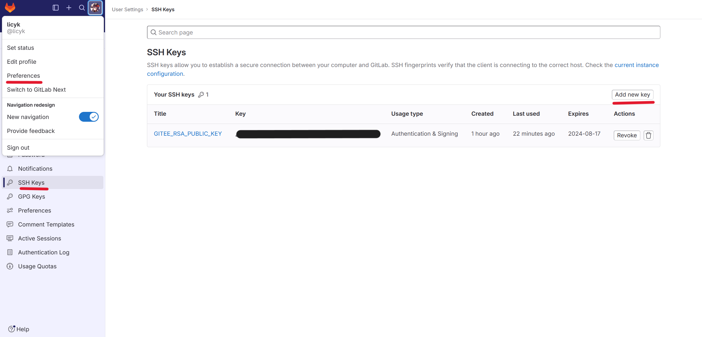
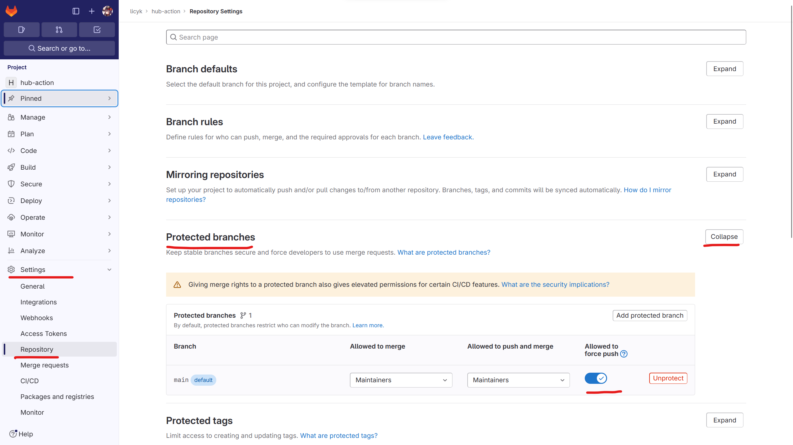

# hub-action
Github Action / 工具合集，工具可查看 [tools](https://github.com/licyk/hub-action/tree/main/tools) 目录


## 当前状态
|Github Action|Status|
|---|---|
|Github -> Gitee / Gitlab|[](https://github.com/licyk/hub-action/actions/workflows/sync-to-mirror.yml)|
|Github Mirror Test|[](https://github.com/licyk/hub-action/actions/workflows/test-avaliable-github-mirror.yml)|
|HuggingFace Mirror Test|[](https://github.com/licyk/hub-action/actions/workflows/test-avaliable-huggingface-mirror.yml)|
|List HuggingFace Repo|[](https://github.com/licyk/hub-action/actions/workflows/list-hugginface-repo.yml)|
|Build PyPI|[](https://github.com/licyk/hub-action/actions/workflows/build-pypi.yml)|
|Build SD Protable Download Page|[](https://github.com/licyk/hub-action/actions/workflows/build-sd-portable-download-pages.yml)|
|Build SD Protable Download Link|[](https://github.com/licyk/hub-action/actions/workflows/build-sd-portable-link.yml)|
|Sync Flash Attn Wheel|[](https://github.com/licyk/hub-action/actions/workflows/sync-flash-attn-whl.yml)|
|Sync HuggingFace / ModelScope Repo|[](https://github.com/licyk/hub-action/actions/workflows/sync-hf-to-ms.yml)|
|Build SageAttention|[](https://github.com/licyk/hub-action/actions/workflows/build-sageattn.yml)|
|Build Triton|[](https://github.com/licyk/hub-action/actions/workflows/build-triton.yml)|
|Clean Outdated SD Portable and Hanafubuki Releases|[](https://github.com/licyk/hub-action/actions/workflows/clean-outdated-sd-portable.yml)|
|Clean HuggingFace Repo Space|[](https://github.com/licyk/hub-action/actions/workflows/clean-hf-repo.yml)|
|Build LoRA Download Page|[](https://github.com/licyk/hub-action/actions/workflows/build-lora-download-page.yml)|
|Build SpargeAttention|[](https://github.com/licyk/hub-action/actions/workflows/build-spargeattn.yml)|
|Build and Test Triton|[](https://github.com/licyk/hub-action/actions/workflows/build-and-test-triton.yml)|
|Remove LoRA norm block and sync (for InvokeAI)|[](https://github.com/licyk/hub-action/actions/workflows/remove-lora-norm-block-and-sync.yml)|
|Build SageAttention3|[](https://github.com/licyk/hub-action/actions/workflows/build-sageattn3.yml)|
|Trigger aria2-next Package Update|[](https://github.com/licyk/hub-action/actions/workflows/trigger-aria2-next-package-update.yml)|
|Build HF and MS Repo List|[](https://github.com/licyk/hub-action/actions/workflows/build-huggingface-and-modelscope-repo-list.yml)|
|Query VCRedist x64 DLLs|[](https://github.com/licyk/hub-action/actions/workflows/query-vcredist-x64-dlls.yml)|

VCRedist x64 DLL 查询默认下载链接来源：[Microsoft Visual C++ Redistributable latest supported downloads](https://learn.microsoft.com/en-us/cpp/windows/latest-supported-vc-redist?view=msvc-170#latest-supported-redistributable-version)


## 同步仓库教程
使用 [scripts/git_mirror.py](scripts/git_mirror.py) 进行同步，仓库列表统一写在 [scripts/mirror_repos.json](scripts/mirror_repos.json) 里，由 [Sync To Mirror](.github/workflows/sync-to-mirror.yml) 工作流调用。

该脚本只依赖 Python 标准库，支持多线程并发同步，用法见[同步脚本用法](#同步脚本用法)。

### 1、生成 SSH 公钥

执行命令：`ssh-keygen -t rsa -C "youremail@example.com"`，连续三次回车，id_rsa  为`私钥`，id_rsa.pub 为`公钥`  
不使用默认 SSH 参考：[生成 / 添加 SSH 公钥](https://help.gitee.com/enterprise/code-manage/%E6%9D%83%E9%99%90%E4%B8%8E%E8%AE%BE%E7%BD%AE/%E9%83%A8%E7%BD%B2%E5%85%AC%E9%92%A5%E7%AE%A1%E7%90%86/%E7%94%9F%E6%88%90%E6%88%96%E6%B7%BB%E5%8A%A0SSH%E5%85%AC%E9%92%A5)


### 2、GitHub 项目配置 SSH 密钥

在 Github 项目  
`Settings`->`Secrets`->`Actions`，名称为：`GITEE_RSA_PRIVATE_KEY`，值为：上面生成 SSH 的`私钥`





### 3、GitHub 配置 SSH 公钥



在 Github 中  
`Settings`->`SSH and GPG keys`->`New SSH key`，名称为：`GITEE_RSA_PUBLIC_KEY`，值为：上面生成SSH的`公钥`


### 4、Gitee 配置 SSH 公钥

在 Gitee 中  
`设置`->`安全设置`->`SSH公钥`，标题为：`GITEE_RSA_PUBLIC_KEY`，值为：上面生成 SSH 的`公钥`




### 5、GitHub 创建 Github workflow

在 Github 项目  
`Actions`创建一个新的 workflow





需要同步的仓库写在 `scripts/mirror_repos.json` 里，一条仓库配置支持三种写法：

```jsonc
{
  "source": {
    // {name} 会被替换成源仓库名
    "url": "git@github.com:licyk/{name}.git",
    // 克隆源仓库用的私钥所在的环境变量，没有设置时回落到第一个可用平台的私钥
    "key_env": "SOURCE_SSH_PRIVATE_KEY"
  },
  "destinations": {
    "gitee": {
      "url": "git@gitee.com:licyk/{name}.git",
      "key_env": "GITEE_RSA_PRIVATE_KEY",
      // 为 false 时默认不同步，需要用 --destination gitee 显式指定
      "enabled": true
    }
  },
  "repos": [
    // 1. 两边同名
    "hub-action",
    // 2. 源仓库 foo 同步到目的仓库 bar
    "foo:bar",
    // 3. 只在某个平台上改名，或者只同步到部分平台
    { "src": "t", "rename": { "gitee": "tt" }, "destinations": ["gitee", "gitlab"] },
    // 4. 除了某个平台，其他都同步
    { "src": "SDNote", "exclude_destinations": ["gitee"] },
    // 5. 平时不同步，但配置留着
    { "src": "some-repo", "enabled": false }
  ]
}
```

挑选要同步的仓库有四种办法，按需要挑一种：

|办法|适用场景|
|---|---|
|配置里 `"enabled": false`|这个仓库长期不需要同步。比直接把整行删掉好，能看出是特意不同步而不是漏加了|
|配置里 `"destinations": [...]`|白名单，这个仓库只同步到列出的平台|
|配置里 `"exclude_destinations": [...]`|黑名单，这个仓库不同步到列出的平台|
|命令行 `--repo` / `--exclude`|临时只跑其中几个仓库，两者都支持通配符|

`--repo` 写通配符时只会命中已启用的仓库；把仓库名原样写出来时，
即使它在配置里是 `"enabled": false` 也照样同步，因为指名道姓就是明确想要它。
想一次性带上所有被禁用的仓库则用 `--include-disabled`。

模式没有匹配到任何仓库时脚本会直接报错退出，免得名字拼错以后悄悄少同步一个。

想表达"除了某个平台哪里都同步"时用黑名单而不是白名单：以后配置里新增一个平台，
白名单写法会把新平台漏掉，黑名单写法不会。两者同时列出同一个平台会直接报配置错误。

workflow 里调用脚本，各平台的私钥通过环境变量传进去：

```yml
name: Sync To Mirror

on:
  schedule:
    - cron: '0 16 * * *' # 北京时间每日 00:00 执行
  workflow_dispatch:

jobs:
  git-mirror:
    runs-on: ubuntu-latest
    steps:
      - name: Checkout
        uses: actions/checkout@v4

      - name: Setup Python
        uses: actions/setup-python@v6
        with:
          python-version: '3.x'

      - name: Sync repos
        shell: bash
        env:
          # 注意在 Settings -> Secrets 配置这些私钥
          GITEE_RSA_PRIVATE_KEY: ${{ secrets.GITEE_RSA_PRIVATE_KEY }}
          GITLAB_RSA_PRIVATE_KEY: ${{ secrets.GITLAB_RSA_PRIVATE_KEY || secrets.GITEE_RSA_PRIVATE_KEY }}
        run: python scripts/git_mirror.py --jobs 6
```


### 同步脚本用法

```shell
# 同步配置里已启用的所有平台（fanout 模式：每个仓库只克隆一次，并发推送到所有平台）
python scripts/git_mirror.py

# 一对一模式：每个（仓库，平台）组合各自克隆并推送，与旧的 matrix 行为一致
python scripts/git_mirror.py --mode pairwise

# 只同步指定平台和指定仓库
python scripts/git_mirror.py --destination gitee --repo hub-action,term-sd

# 用通配符挑一批仓库，或者反过来排除一批
python scripts/git_mirror.py --repo 'ComfyUI-*'
python scripts/git_mirror.py --exclude 'sd-webui-*,aria2-*'

# 连同配置里 enabled 为 false 的仓库一起同步
python scripts/git_mirror.py --include-disabled

# 演练，不实际推送
python scripts/git_mirror.py --dry-run

# 只看这次会同步哪些仓库
python scripts/git_mirror.py --list
```

|参数|说明|默认值|
|---|---|---|
|`--config`|仓库配置文件|`scripts/mirror_repos.json`|
|`--mode`|`fanout` / `one-to-many` 克隆一次推送到所有平台；`pairwise` / `one-to-one` 每个平台各自克隆|`fanout`|
|`--destination`|只同步指定平台，可重复或用逗号分隔，`all` 表示包括未启用的平台|配置里 `enabled` 的平台|
|`--repo`|只同步指定仓库（按源仓库名，支持通配符），可重复或用逗号分隔|全部|
|`--exclude`|排除指定仓库（按源仓库名，支持通配符），可重复或用逗号分隔|无|
|`--include-disabled`|连同配置里 `enabled` 为 false 的仓库一起同步|关闭|
|`--jobs`|同时克隆的仓库数，也决定磁盘占用|`6`|
|`--push-jobs`|fanout 模式下单个仓库同时推送的平台数|平台数量|
|`--dry-run`|推送时加上 `--dry-run`，不实际写入目的平台|关闭|
|`--timeout`|单条 git 命令的超时秒数|`1800`|
|`--retries`|克隆和推送的尝试次数|`3`|
|`--retry-delay`|重试间隔秒数|`5`|
|`--no-color`|关闭彩色输出|自动判断|
|`--list`|只打印本次会同步哪些仓库，不实际执行|关闭|

脚本会把 `refs/heads` 和 `refs/tags` 之外的引用（比如 GitHub 额外公开的 `refs/pull/*`）在推送前删掉，
否则 Gitee / GitLab / Bitbucket 会拒绝这些引用，导致整次推送失败。

另外可以设置 `SSH_KNOWN_HOSTS` 环境变量来启用主机密钥校验，不设置时会跳过校验并给出警告。

如果同步到 Gitee 的 Github Action 出现`remote: error: GE007: Your push would publish a private email address.`这个报错，则在 Gitee `设置`->`邮箱管理` , √ 去掉



将 Github 同步到 Gitlab 也是一样的方法  
[第 4 步方法](#4gitee-配置-ssh-公钥)改为：  
左上角点击头像，`Preferences`->`SSH Keys`->`Add new key`，在 Title 输入`GITEE_RSA_PUBLIC_KEY`，Key 输入上面生成 SSH 的`公钥`



如果同步到 Gitlab 的 Github Action 运行报错时可以在项目中的`Settings`->`Repository`->`Protected branches`右边的`Expand`,把`Allowed to force push`按钮打开，或者点`Unprotect`


