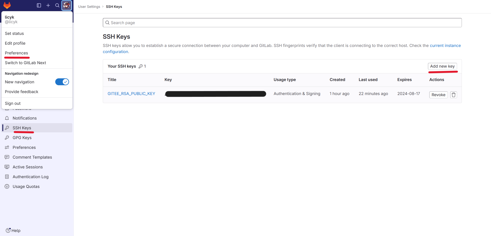

# hub-action
使用[git-mirror-action](https://github.com/wearerequired/git-mirror-action)进行同步

## 使用教程

### 1、生成SSH公钥

执行命令：`ssh-keygen -t rsa -C "youremail@example.com"`，连续三次回车，id_rsa 为`私钥`，id_rsa.pub为`公钥`
不使用默认SSH参考：[生成/添加SSH公钥](https://help.gitee.com/enterprise/code-manage/%E6%9D%83%E9%99%90%E4%B8%8E%E8%AE%BE%E7%BD%AE/%E9%83%A8%E7%BD%B2%E5%85%AC%E9%92%A5%E7%AE%A1%E7%90%86/%E7%94%9F%E6%88%90%E6%88%96%E6%B7%BB%E5%8A%A0SSH%E5%85%AC%E9%92%A5)

### 2、GitHub项目配置SSH密钥

在Github项目
`Settings`->`Secrets`->`Actions`，名称为：`GITEE_RSA_PRIVATE_KEY`，值为：上面生成SSH的`私钥`


### 3、GitHub配置SSH公钥


在Github
`Settings`->`SSH and GPG keys`->`New SSH key`，名称为：`GITEE_RSA_PUBLIC_KEY`，值为：上面生成SSH的`公钥`

### 4、Gitee配置SSH公钥

在Gitee
`设置`->`安全设置`->`SSH公钥`，标题为：`GITEE_RSA_PUBLIC_KEY`，值为：上面生成SSH的`公钥`


### 5、GitHub创建Github workflow

在Github项目
`Actions`创建一个新的workflow


- 同步单个项目
```yml
name: Sync To Gitee

on: # 这里是github action的触发条件
  schedule:
  - cron: '0 8 * * *' # 每日24点进行同步
  push:
  delete:
  create:

jobs:
  build:
    runs-on: ubuntu-latest
    steps:

      - name: Sync yourreponame to Gitee
        uses: wearerequired/git-mirror-action@master
        env:
          # 注意在 Settings->Secrets 配置 GITEE_RSA_PRIVATE_KEY
          SSH_PRIVATE_KEY: ${{ secrets.GITEE_RSA_PRIVATE_KEY }}
        with:
          # 注意替换为你的 GitHub 源仓库地址
          source-repo: git@github.com:username/yourreponame.git
          # 注意替换为你的 Gitee 目标仓库地址
          destination-repo: git@gitee.com:username/yourreponame.git
```
- 同步多个项目
```yml
name: Sync To Gitee

on: # 这里是github action的触发条件
  schedule:
  - cron: '0 16 * * *' # 每日24点进行同步
  push:
  delete:
  create:

jobs:
  build:
    runs-on: ubuntu-latest
    steps:

      - name: Sync yourreponame_1 to Gitee
        uses: wearerequired/git-mirror-action@master
        env:
          # 注意在 Settings->Secrets 配置 GITEE_RSA_PRIVATE_KEY
          SSH_PRIVATE_KEY: ${{ secrets.GITEE_RSA_PRIVATE_KEY }}
        with:
          # 注意替换为你的 GitHub 源仓库地址
          source-repo: git@github.com:username/yourreponame_1.git
          # 注意替换为你的 Gitee 目标仓库地址
          destination-repo: git@gitee.com:username/yourreponame_1.git

      - name: Sync yourreponame_2 to Gitee
        uses: wearerequired/git-mirror-action@master
        env:
          # 注意在 Settings->Secrets 配置 GITEE_RSA_PRIVATE_KEY
          SSH_PRIVATE_KEY: ${{ secrets.GITEE_RSA_PRIVATE_KEY }}
        with:
          # 注意替换为你的 GitHub 源仓库地址
          source-repo: git@github.com:username/yourreponame_2.git
          # 注意替换为你的 Gitee 目标仓库地址
          destination-repo: git@gitee.com:username/yourreponame_2.git
```

如果同步到gitee的github Action出现`remote: error: GE007: Your push would publish a private email address.`这个报错，则在gitee `设置`->`邮箱管理` , √去掉


将github同步到gitlab也是一样的方法  
第4步方法改为：  
左上角点击头像，`Preferences`->`SSH Keys`->`Add new key`，在Title输入`GITEE_RSA_PUBLIC_KEY`，Key输入上面生成SSH的`公钥`



如果同步到gitlab的action运行报错时可以在项目中的`Settings`->`Repository`->`Protected branches`右边的`Expand`,把`Allowed to force push`按钮打开，或者点`Unprotect`


